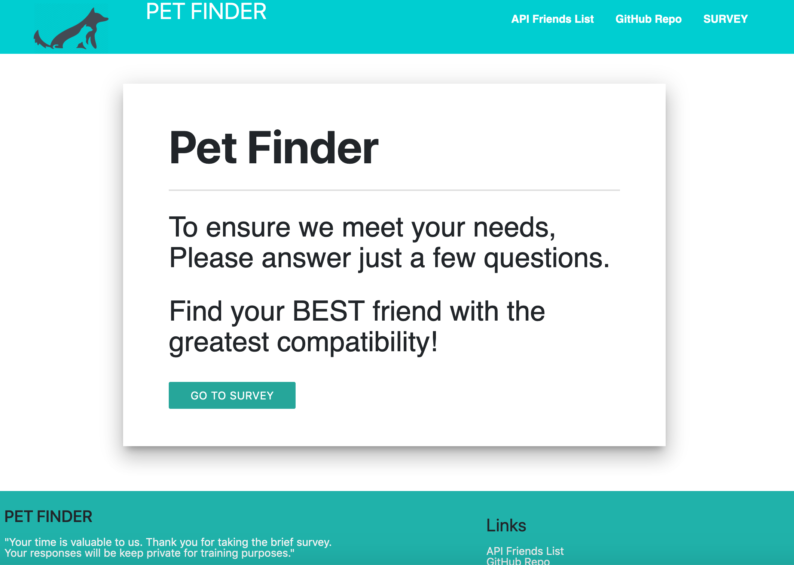

Pet FINDER App
=================

Description

Pet Finder is a pet adoption App based on user's responses to a ten question survey. The user response to 
questions with values from 1(Strong Disagree) to 5 (Strong Agree). When the survey is submitted an existing record closest to the current user's responses is found and returned. The closed set of user responses is define  as the set with the lowest absolute difference for all ten questions combined.

>The App is meant to simulate a simple pet adoption app. Pet Finder application is implemented using a ***Node.js*** >>>>(https://nodejs.org/en/and )***Express*** server on the back end and the Materialize CSS framework on the front end.

Demo
=======
Pet Finder is deployed to Heroku. Please check it out **[here](https://coolfriend.herokuapp.com/)**.

Installation
==============
To install the app follow the instruction below:
> git clone git@github.com:codifyme/petfinder.git
> cd friendFinder
> npm install

>Running Locally
To run the app locally and access to your brower, first set the ***PORT*** environment variable to the value of your choices. An example is show below.

>export PORT=3000
After the PORT envirionment variable has been set, run the Node.js application with the command below.
>node server.js
>
>The app will now be running locally on ***PORT***, in this case is port 3000, you can access it localy from your browser at >the URL localhost:PORT, in this case localhost:3030.

Screen Shot
-------------

## Built With

- Visual Studio Code - Text Editor
- Heroku
- Javascript
- Node.js
- Terminal/Gitbash
## Technologies and packages I used

1. npm init => initialize package.json
2. npm install => create package-lock.json
3. npm install => Install the npm express package
3. npm i inquirer => install **[inquirer package](https://www.npmjs.com/package/inquirer)**
4. npm i dotenv => install **[dotenv package](https://www.npmjs.com/package/dotenv)**

# Author

>-  **[Angel-Cochachez](https://github.com/codifyme/FriendFinder/)**.

Happy Matching!
